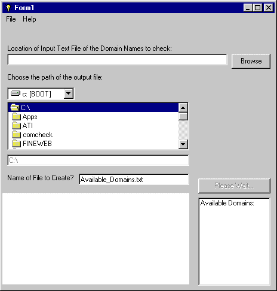



## Domain Name Finder

### Description

This is a GREAT Utility to find a domain name. You can feed it a dictionary and it will tell you what names are available! Simply select a txt file which contains words seperated by spaces and let it find the available .com's! Any feedback would be great! Uses Microsoft Internet Controls and HTML Object Library.
 
### More Info
 
Text File

Must have an internet connection allowing TCP/IP and this code will access www.register.com for finding available domain names. Uses Microsoft Internet Controls and HTML Object Library

New Text File

             |
---                |---
**Submitted On**   |2001-01-30 12:22:50
**By**             |[hoquet](https://github.com/Planet-Source-Code/PSCIndex/blob/master/ByAuthor/hoquet.md)
**Level**          |Intermediate
**User Rating**    |5.0 (15 globes from 3 users)
**Compatibility**  |VB 4\.0 \(16\-bit\), VB 4\.0 \(32\-bit\), VB 5\.0, VB 6\.0
**Category**       |[Complete Applications](https://github.com/Planet-Source-Code/PSCIndex/blob/master/ByCategory/complete-applications__1-27.md)
**World**          |[Visual Basic](https://github.com/Planet-Source-Code/PSCIndex/blob/master/ByWorld/visual-basic.md)
**Archive File**   |[CODE\_UPLOAD143381302001\.zip](https://github.com/Planet-Source-Code/hoquet-domain-name-finder__1-14848/archive/master.zip)

